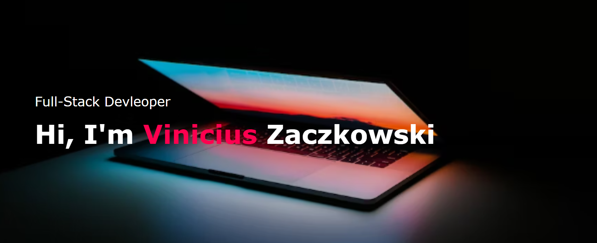

# My Portfolio v2

## Description

Welcome to version 2 of my portfolio page!. I built this webpage to simplify the hiring process for any potential employer and highlight my best projects as well as my ability to create and maintain a webpage. Furthermore, this project helped keep my HTML and CSS skills fresh and relevant. While the style and layout are taken from a tutorial the tutorial was only used as a guideline while I implemented my own HTML, CSS, and JavaScript. In making this web page I learned a lot about different CSS methods to produce fun effects on a webpage. I also reinforced my knowledge of DOM traversal in JavaScript.

## Usage

If viewing on a screen larger than 707p you will see a nav bar at the top-right of the page. Each button in the nav bar is fully functional and will take you to the corresponding section. scrolling down to the 'About Me' section you'll see technical skills, certifications, and soft skills. clicking any of those will display a list of relevant information about my qualifications. moving further down you will see 'My Work' which displays either my three most recent or three most impressive projects (dependant on when this page is viewed). each project features a screenshot of the said project, a brief description, as well as two links: one to the deployed page(if applicable) and one to the GitHub repository. Should you wish to view more content by me there is a 'see more' button which will take you to the list of all my repositories on GitHub. finally under 'Contact Me' there is a submission form which will take all the information gathered and add it to a google spreadsheet which will notify me changes were made. Additionally there is a clickable linkedin and GitHub icon that will take you to my profile on those websites. underneath the icons there is a 'Download Resume' button that will, as the button implies, download my resume onto your device.

## License

MIT License

## How to Contribute

Contributions are not being accepted at this time.

